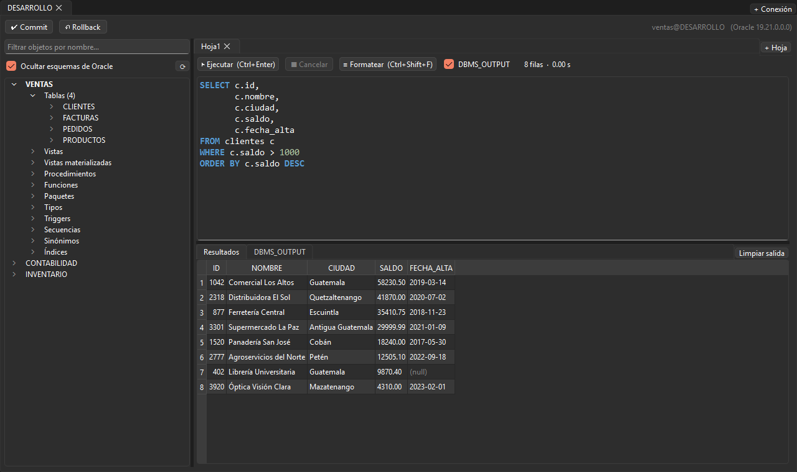
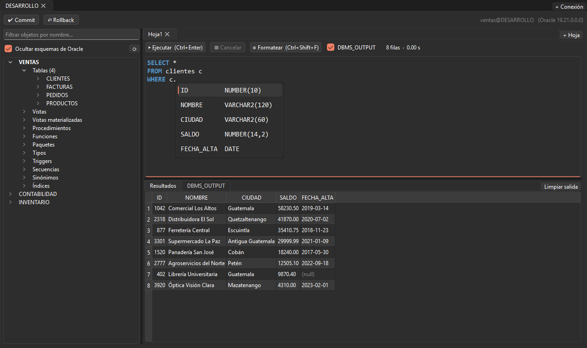
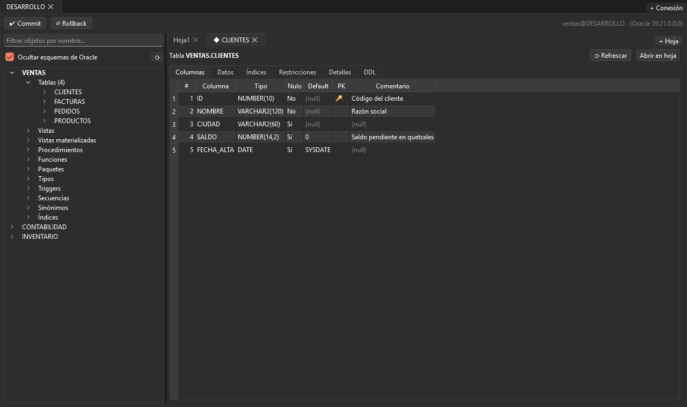
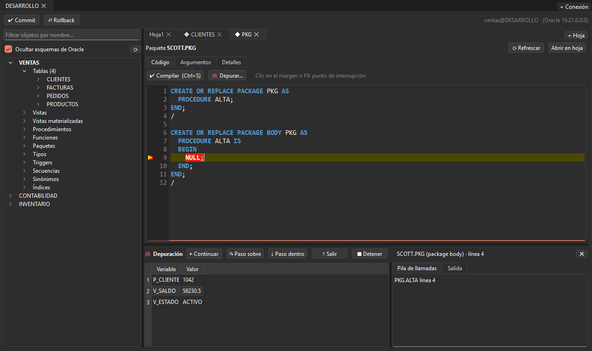

# MiniSQL

[](https://github.com/AndreeAvalos/mini-sql/actions/workflows/tests.yml)


[](LICENSE)

Cliente de escritorio ligero para **Oracle**, hecho con PySide6 y python-oracledb en modo *thin*:
no necesita Oracle Client instalado. Pensado para el trabajo diario con SQL y PL/SQL: hojas de consultas,
explorador de objetos, autocompletado, edición y compilación de paquetes, y depuración paso a paso.



## Funciones

- **Varias conexiones y hojas en pestañas.** Cada conexión tiene su explorador y sus hojas; todas comparten la
  transacción de la conexión, con Commit/Rollback explícitos (autocommit apagado).
- **Ejecución sin congelar la ventana**, con cancelación, tiempo transcurrido y hasta 1000 filas por consulta.
  Ctrl+Enter ejecuta la sentencia donde está el cursor (se separan con una línea en blanco).
- **Confirmaciones de seguridad** antes de `UPDATE`/`DELETE` sin `WHERE`, `DROP`, `TRUNCATE` y DDL con cambios
  pendientes.
- **Autocompletado** de palabras clave, funciones, esquemas, tablas, columnas, paquetes y secuencias. Entiende los
  alias del `FROM`/`JOIN`, sigue sinónimos y agrega el alias al completar una tabla o una columna.
- **Colores de sintaxis** y **formateo** de SQL (Ctrl+Shift+F).
- **DBMS_OUTPUT** en cada hoja; acepta `SET SERVEROUTPUT ON` y `EXEC procedimiento` como en SQL*Plus.
- **Explorador de objetos** con filtro, y **visor** de tablas, vistas, paquetes, procedimientos, secuencias,
  índices…: columnas, datos, índices, restricciones, detalles y DDL. F4 abre el objeto bajo el cursor.
- **Edición y compilación de PL/SQL** con lista de errores que lleva a la línea.
- **Depuración PL/SQL** con breakpoints, pasos (F10/F11/Shift+F11), variables, pila de llamadas y el valor de
  cada variable al pasar el mouse.
- **Nunca se pierde trabajo:** las hojas se guardan solas cada pocos segundos y se recuperan al volver a abrir,
  incluso después de un cierre inesperado.

| Autocompletado con alias | Visor de objetos |
|---|---|
|  |  |



## Instalación

Requiere Python 3.10 o superior.

```bash
git clone https://github.com/AndreeAvalos/mini-sql.git
cd mini-sql
python -m pip install -r requirements.txt
python main.py
```

También se puede instalar como paquete, lo que agrega el comando `minisql`:

```bash
python -m pip install .
minisql
```

> **Oracle 11g o anterior:** el modo *thin* necesita Oracle 12.1 o superior. Para versiones antiguas, instala
> Oracle Instant Client y descomenta `oracledb.init_oracle_client(...)` en `minisql/db/__init__.py`.

## Uso

Al abrir aparece el diálogo de conexión. Puedes usar un alias de tu `tnsnames.ora` (indica la ruta del archivo
una vez) o escribir `host:puerto/servicio`. Los perfiles se guardan sin contraseña; la contraseña puede quedar en
el llavero del sistema (Administrador de credenciales de Windows, Keychain de macOS…).

### Atajos

| Atajo | Acción |
|---|---|
| Ctrl+Enter | Ejecutar la sentencia del cursor o el texto seleccionado |
| Ctrl+Espacio | Autocompletar |
| Ctrl+Shift+F | Formatear la sentencia del cursor |
| F4 | Abrir el objeto cuyo nombre está bajo el cursor |
| Ctrl+T / Ctrl+W | Nueva hoja / cerrar hoja |
| Ctrl+N | Nueva conexión |
| Ctrl+S | Compilar (en la pestaña Código de un objeto) |
| F9 | Poner o quitar breakpoint |
| F5 · F10 · F11 · Shift+F11 · Shift+F5 | Depuración: continuar · paso sobre · paso dentro · salir · detener |
| Doble clic en una pestaña | Renombrar la hoja |

### Depuración PL/SQL

Usa `DBMS_DEBUG`. El usuario necesita el privilegio `DEBUG CONNECT SESSION` y poder depurar el objeto
(ser su dueño, o tener `DEBUG` sobre él o `DEBUG ANY PROCEDURE`). Al iniciar, MiniSQL arma un bloque de prueba con
los argumentos del procedimiento y puede recompilarlo con información de depuración.

## Dónde se guardan los datos

Todo queda en tu carpeta de usuario, en `~/.minisql/`, y **nunca se guardan contraseñas en archivos**:

| Archivo | Contenido |
|---|---|
| `conexiones.json` | Perfiles (nombre, usuario, alias) |
| `config.json` | Ruta del `tnsnames.ora` |
| `sesion/indice.json` | Conexiones abiertas y orden de las hojas |
| `sesion/<CONEXIÓN>/<hoja>.sql` | El texto de cada hoja (se escribe solo cuando cambia) |

## Desarrollo

```bash
python -m pip install -r requirements.txt -r requirements-dev.txt
pytest            # pruebas con conexiones simuladas: no necesitan Oracle
ruff check .      # estilo y errores comunes
python docs/generar_capturas.py   # vuelve a generar las imágenes de este README
```

El código está organizado en capas: `minisql/sql` (texto SQL, sin Oracle ni Qt), `minisql/db` (todo lo que
habla con Oracle, en hilos) y `minisql/ui` (interfaz Qt). [CLAUDE.md](CLAUDE.md) describe cada módulo y las
reglas que el código debe mantener.

## Licencia

[MIT](LICENSE) © 2026 Andree Avalos
